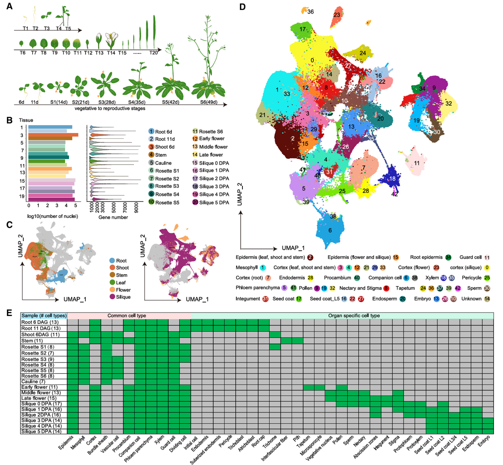
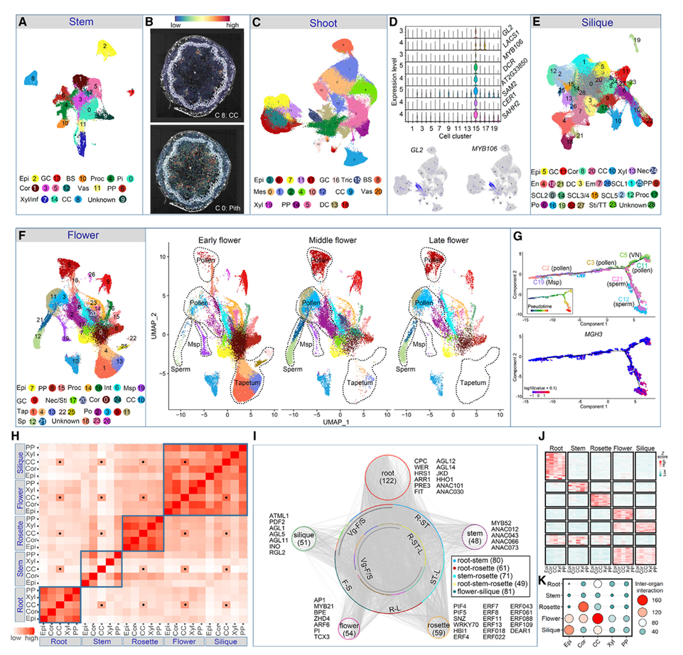
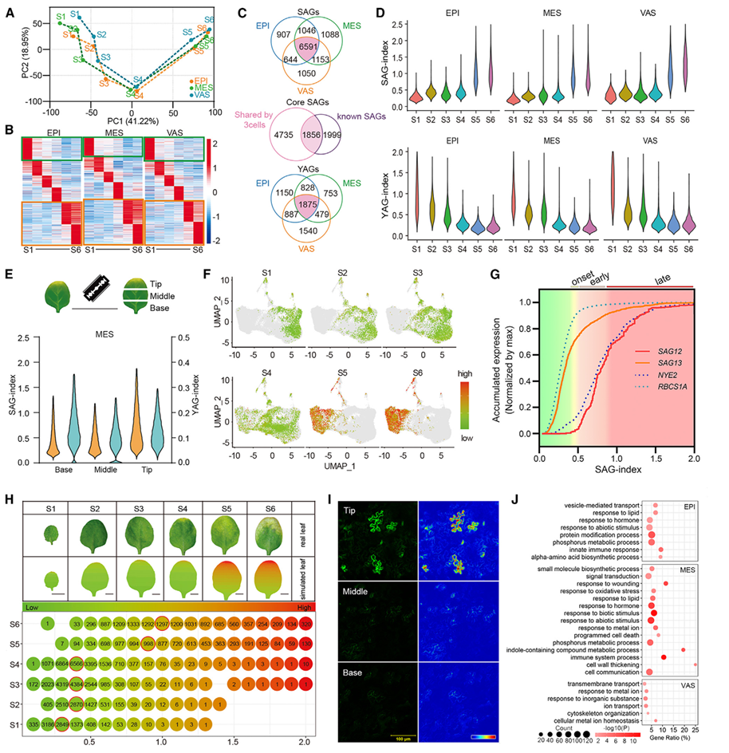
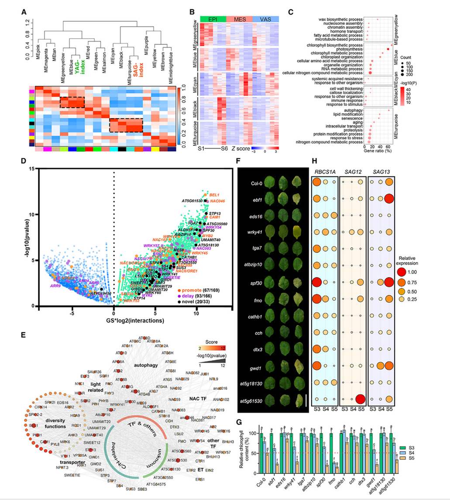

# 一

目的：整合二十个组织的转录组数据
方法：利用单细胞转录组数据构建了细胞全局图谱UMAP，鉴定出38种细胞的类型，从细胞层面并揭示了根上部分、根下部分之间、营养器官和生殖器官之间的不同
结论：构建了拟南芥第一个单细胞分辨率的全局图谱，并注释出了拟南芥38种细胞类型，为后面的数据分析做准备
# 二

目的：利用单细胞转录组数据比较器官内和器官间细胞的差异（细胞类型、细胞转录因子表达）
方法：构建每个器官的细胞图谱，进行分析，鉴定了未知的细胞，构建了某个细胞的标记基因表达水平图，构建了花不同采样时期的细胞图谱，揭示了花不同发育阶段的细胞类型的变化，构建了拟时序轨迹分析图，建立了一个虚拟的时间轴，揭示了小孢子母细胞发育成精子和营养核的整个过程，同时，将精细胞的标记基因映射到时间轴上，随着时间推移，标记基因高表达；为了研究调控网络在器官和细胞特化之间的作用，构建了五个器官中选定细胞类型两两比较的平均基因表达的相关性热图，可看出器官内不同细胞类型的相关性较高，器官间不同细胞类型的相关性较低，又构建了不同器官的器官水平上富集的转录因子共表达网络，以及器官水平富集转录因子的相关性热图，表明器官间异质性较高
# 三

目的：创新性地构建两个指标量化植物叶片不同细胞的衰老状态
方法：1.通过主成分分析发现不同器官的不同细胞的衰老受到协同调控，为了探索这种参与这种协调的基因，2.构建了三种细胞不同采样时期的基因表达热图，找到了在S1期和S2期高表达的基因，使用核心的SAGs和YAGs构建了两个指数，3.可以看到YAGs指数在早期达到峰值，在发育阶段中逐渐降低，SAGs在S4之前都保持低水平，在叶尖变黄时指数剧增，为了验证这两种指数的正确性，4.通过物理的手段将S4期的叶片分为三部分，通过转录组信息绘制不同部分的指数分布，验证了构建的两种指数的科学性。5.将两种指数绘制到UMAP图上，展示了叶片发育过程中细胞状态的异质性。6.通过分析叶绿素降解基因和糖氮转运相关基因以及与衰老相关的基因的表达模式，揭示了SAGs指数与衰老生理事件的时序具有一致性；7.模拟叶片衰老的进程，证实此指数可以正确量化细胞的衰老状态。8.定位衰老启动基因：筛选SAGs指数前百分之五的基因，构建天然启动子插入GFP融合标记株系，标记系统显示这些衰老启动细胞散落在页面，集中在叶尖。9.三种细胞中与中位SAGs指数差异显著的差异表达基因的生物GO富集分析，发现这些基因显著富集于生物胁迫和免疫相关通路，说明叶片的衰老是细胞年龄和基部胁迫共同调控的

目的：鉴定潜在的SAGs枢纽基因
方法：首先构建基因加权共表达网络，鉴定出与已知的YAGs基因和SAGs基因高度相关的五个模块，三中叶片细胞的五个模块的基因表达热图说明了与YAGs相关的基因在早期表达，与SAGs相关的基因在后期表达，通过构建五个模块的生物GO富集分析图，发现与YAGs相关的模块在光合、叶绿素合成的生物过程富集，与SAGs相关的模块在自噬、衰老的生物过程富集，蓝色和绿色时两个分别于SAGs相关和与YAGs相关的模块，其中已知的SAGs基因有近一半在这两个模块中，说明了分析具有高准确性，在图中选取22个不同评分的枢纽基因，分析其与已知的SAGs基因的共表达，发现高度共表达，随后，将这22个基因的T-DNA插入突变体，观察表型，得到11个基因表现出叶片颜色和叶绿体含量的变化
结论：不仅鉴定了潜在的SAGs枢纽基因，同时验证了其与衰老调控有关

